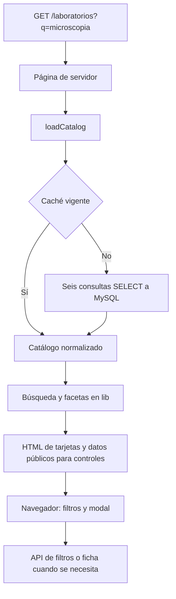

# Cómo está dividido y cómo funciona

[Volver al índice](README.md)

## Las piezas básicas

**React** permite escribir componentes: funciones que reciben datos y devuelven
interfaz. **Next.js** organiza esas interfaces en páginas, ejecuta código de servidor
y expone endpoints HTTP. **TypeScript** comprueba tipos antes de ejecutar; `.tsx`
es TypeScript con etiquetas de interfaz (JSX), y `.ts` contiene lógica sin JSX.

**Node** ejecuta el servidor Next y las herramientas. No corre dentro del navegador.
MySQL sigue siendo la fuente de datos; el portal lo consulta en modo de sólo lectura.

| Carpeta | Responsabilidad | Ejemplo |
| --- | --- | --- |
| `app/` | Páginas, layout y endpoints | `app/laboratorios/page.tsx` |
| `components/atoms/` | Elementos básicos | `Button`, `Input`, `Icon` |
| `components/molecules/` | Combinaciones genéricas | `SearchField`, `Gallery` |
| `components/organisms/` | Secciones y comportamiento del portal | `LaboratoryDialog`, `SearchBar` |
| `lib/` | Datos y funciones sin React | `catalogo`, `buscador`, `fotos` |
| `public/` | Archivos servidos por URL | `public/assets/…` se usa como `/assets/…` |
| `scripts/` | Herramientas que se ejecutan por comando | Generación y revisión de fotos |
| `tests/e2e/` | Pruebas en navegador | Catálogo, fichas, carrusel |
| `.storybook/` | Configuración del explorador de componentes | Historias, estilos y viewports |
| `docs/` | Guías y acuerdos | Este documento |

`@/` en un import apunta a la raíz del proyecto, por ejemplo
`@/lib/catalogo/catalogo`. No hay carpeta `src/` ni barriles `index.ts`.

## Una carpeta define una URL

| Archivo | Resultado |
| --- | --- |
| `app/page.tsx` | `/` |
| `app/laboratorios/page.tsx` | `/laboratorios` |
| `app/laboratorios/[id]/page.tsx` | `/laboratorios/70`, con `id = "70"` |
| `app/contacto/page.tsx` | `/contacto` |
| `app/api/laboratorios/[id]/route.ts` | Endpoint que devuelve JSON |
| `app/layout.tsx` | Envoltura común: estructura HTML, cabecera y pie |

Los CSS Modules de una página viven junto a su `page.tsx`: por ejemplo,
`app/laboratorios/Laboratorios.module.css` y
`app/laboratorios/[id]/Laboratorio.module.css`. `Inicio.module.css` permanece en
`app/` porque corresponde a `/`; `globals.css` contiene los estilos compartidos.

`page.tsx` exporta por defecto un componente. `route.ts` exporta funciones HTTP
como `GET`. Una carpeta cualquiera no se convierte en página sin su archivo
especial. Usa `Link` de Next para enlaces internos.

En esta versión, `params` y `searchParams` de las páginas se consumen de forma
asíncrona. Copia el patrón de las páginas actuales (`await params`,
`await searchParams`) en vez de ejemplos de versiones antiguas.

## Servidor y navegador

Por defecto, las páginas son **Server Components**: pueden esperar datos de MySQL
y generar HTML sin mandar esa lógica SQL al navegador.

Un archivo con `"use client"` establece una frontera para componentes interactivos:
puede usar estado (`useState`), eventos y efectos. Sus imports forman parte de esa
rama cliente; no importar allí el pool, el catálogo del servidor ni secretos.
Los Client Components también pueden participar en el HTML inicial: no significa
que todo su código sólo se ejecute después de abrir el navegador. Acceder a
`window` durante el render puede fallar; úsalo en un evento o efecto apropiado.

Las **props** son los argumentos de un componente. Al pasarlas de servidor a cliente,
usa datos serializables: cadenas, números y objetos públicos sencillos. Una función
normal del servidor no se puede pasar como callback de clic a esa frontera.

## Qué ocurre al abrir el catálogo

La caché dura 600 segundos por defecto y conserva la copia anterior si falla una
recarga. Vive en memoria de cada proceso, no en una base aparte. El navegador no
recibe todo el catálogo de servicios y equipos para hacer las búsquedas.

El modal usa History API para cambiar la URL sin desmontar el catálogo. Atrás,
Adelante y cerrar conservan contexto. Si compartes o recargas esa URL, Next sirve
la ficha individual. Ambas vistas reutilizan `LaboratoryDetails`.

## Cómo decidir dónde editar

Texto de portada: `app/page.tsx`. Estilo de una tarjeta: su CSS Module.
Regla de búsqueda: `lib/buscador/`. Consulta SQL: `lib/catalogo/`.
Interacción del carrusel: `public/js/carrusel.js` y su organismo; es una mejora
sobre HTML de servidor y no exige convertir toda la portada a cliente.

Antes de añadir una dependencia o cambiar la estrategia de renderizado, consulta
las decisiones del README. La documentación de la versión instalada está en
`node_modules/next/dist/docs/` después de `npm ci`.
